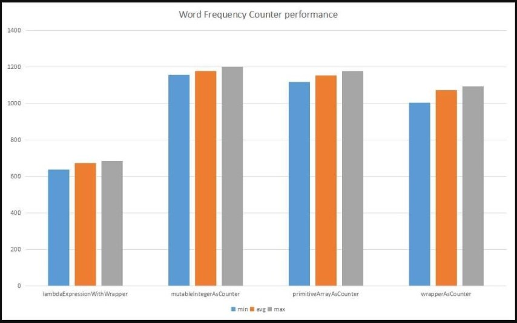

# 1. Visão Geral
Neste tutorial, mostraremos várias maneiras de implementar um contador de palavras em Java.

# 2. Implementações de contador
Vamos começar simplesmente calculando a contagem de palavras nesta matriz:

```
static String[] COUNTRY_NAMES 
  = { "China", "Australia", "India", "USA", "USSR", "UK", "China", 
  "France", "Poland", "Austria", "India", "USA", "Egypt", "China" };
```

Se quisermos processar arquivos grandes, precisamos ir para outras opções descritas aqui.

# 2.1. Mapa com inteiros
Uma das soluções mais simples seria criar um mapa, armazenar palavras como chaves e o número de ocorrências como valores:

```
Map<String, Integer> counterMap = new HashMap<>();

for (String country : COUNTRY_NAMES) { 
    counterMap.compute(country, (k, v) -> v == null ? 1 : v + 1); 
}

assertEquals(3, counterMap.get("China").intValue());
assertEquals(2, counterMap.get("India").intValue());
```

Simplesmente usamos o prático método de computação do Map, que incrementa o contador ou o inicializa com 1 se a chave não estiver presente.

No entanto, esse método de criação de contador não é eficiente, pois Integer é imutável, portanto, sempre que incrementamos o contador, criamos um novo objeto Integer.

### 2.2. API Stream
Agora, vamos aproveitar a API Java 8 Stream, Streams paralelos e o coletor groupingBy():

```
@Test
public void whenMapWithLambdaAndWrapperCounter_runsSuccessfully() {
    Map<String, Long> counterMap = new HashMap<>();
 
    Stream.of(COUNTRY_NAMES)
      .collect(Collectors.groupingBy(k -> k, ()-> counterMap,
	    Collectors.counting());

    assertEquals(3, counterMap.get("China").intValue());
    assertEquals(2, counterMap.get("India").intValue());
}
```

Da mesma forma, podemos usar um parallelStream:

```
@Test
public void whenMapWithLambdaAndWrapperCounter_runsSuccessfully() {
    Map<String, Long> counterMap = new HashMap<>();
 
    Stream.of(COUNTRY_NAMES).parallel()
      .collect(Collectors.groupingBy(k -> k, ()-> counterMap,
	    Collectors.counting());

    assertEquals(3, counterMap.get("China").intValue());
    assertEquals(2, counterMap.get("India").intValue());
}
```

### 2.3. Mapa com um array inteiro
A seguir, vamos usar um mapa que envolve um contador em uma matriz de inteiros usada como um valor:

```
@Test
public void whenMapWithPrimitiveArrayCounter_runsSuccessfully() {
    Map<String, int[]> counterMap = new HashMap<>();

    counterWithPrimitiveArray(counterMap);

    assertEquals(3, counterMap.get("China")[0]);
    assertEquals(2, counterMap.get("India")[0]);
}
 
private void counterWithPrimitiveArray(Map<String, int[]> counterMap) {
    for (String country : COUNTRY_NAMES) {
        counterMap.compute(country, (k, v) -> v == null ? 
          new int[] { 0 } : v)[0]++;
    }
}
```

Observe como criamos um HashMap simples com matrizes int como valores.

No método counterWithPrimitiveArray, enquanto iteramos sobre cada valor da matriz, nós:

- Invoque um get no counterMap passando o nome do país como uma chave;
- Verifique se uma chave já estava presente ou não. Se a entrada já estiver presente, criamos uma nova instância de array inteiro primitivo com um único “1”. Se a entrada estiver ausente, incrementamos o valor do contador presente na matriz.

Este método é melhor do que a implementação do wrapper - pois cria menos objetos.

### 2.4. Mapa com MutableInteger
A seguir, vamos criar um objeto wrapper que incorpora um contador inteiro primitivo como abaixo:

```
private static class MutableInteger {
    int count = 1;
	
    public void increment() {
        this.count++;
    }
	
    // getter and setter
}
```

Vamos ver como podemos usar a classe acima como um contador:

```
@Test
public void whenMapWithMutableIntegerCounter_runsSuccessfully() {
    Map<String, MutableInteger> counterMap = new HashMap<>();

    mapWithMutableInteger(counterMap);

    assertEquals(3, counterMap.get("China").getCount());
    assertEquals(2, counterMap.get("India").getCount());
}
private void counterWithMutableInteger(
  Map<String, MutableInteger> counterMap) {
    for (String country : COUNTRY_NAMES) {
        counterMap.compute(country, (k, v) -> v == null 
          ? new MutableInteger(0) : v).increment();
    }
}
```

No método mapWithMutableInteger, enquanto iteramos sobre cada país na matriz COUNTRY_NAMES, nós:

invocar get no counterMap passando o nome do país como uma chave
verifique se a chave já está presente ou não. Se uma entrada estiver ausente, criamos uma instância de MutableInteger que define o valor do contador como 1. Incrementamos o valor do contador presente no MutableInteger se o país estiver presente no mapa
Este método de criar um contador é melhor do que o anterior - já que estamos reutilizando o mesmo MutableInteger e, portanto, criando menos objetos.

É assim que o Apache Collections HashMultiSet funciona, onde incorpora um HashMap com valor como MutableInteger internamente.

# 3. Análise de desempenho
Aqui está o gráfico que compara o desempenho de cada método listado acima.



O gráfico acima é criado usando JMH e aqui está o código que criou as estatísticas acima:

```
Map<String, Integer> counterMap = new HashMap<>();
Map<String, MutableInteger> counterMutableIntMap = new HashMap<>();
Map<String, int[]> counterWithIntArrayMap = new HashMap<>();
Map<String, Long> counterWithLongWrapperMap = new HashMap<>();
 
@Benchmark
public void wrapperAsCounter() {
    counterWithWrapperObject(counterMap);
}

@Benchmark
public void lambdaExpressionWithWrapper() {
    counterWithLambdaAndWrapper(counterWithLongWrapperMap );
}

@Benchmark
public void parallelStreamWithWrapper() {
    counterWithParallelStreamAndWrapper(counterWithLongWrapperStreamMap);
}
    
@Benchmark
public void mutableIntegerAsCounter() {
    counterWithMutableInteger(counterMutableIntMap);
}
    
@Benchmark
public void mapWithPrimitiveArray() {
   counterWithPrimitiveArray(counterWithIntArrayMap);
}
```

# 4. Conclusão
Neste artigo rápido, ilustramos várias maneiras de criar contadores de palavras usando Java.